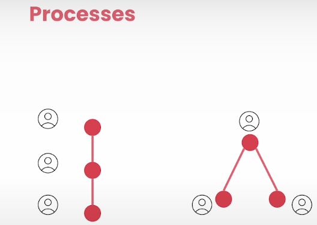
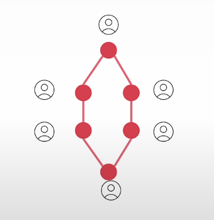

# How do multi agent collaborate?

For Sequential processes; there are some consequences like
- Initial contexts slowly fades away as tasks gets passed from one agent to other agent

- crewai offers flexibility for that

**Processes**

- all the agents of creai, have been working mainly in seqential process.
- did some experiment with paralle exec, but most of them are just performing tasks sequentially.

* other ways to perform tasks:

__Hierarchical:__

- lot of benefits
- you get a single point for reference

- its like - you got a manager that always remembers the initial goal and tha automatically, deleates th ework to the other memebers and other agents in this crew

- also reviews resulyts as theses agents wrap their work, it also asks for further improvement if necessary.

__Asynchronous Execution:__

- independent of process, creai offers also offers ability to execute certain tasks in parallel
- you have other tasks, wait for them to be finished if necessary
- you can have manager that reviews work
- you can have taska that happen in parallel

