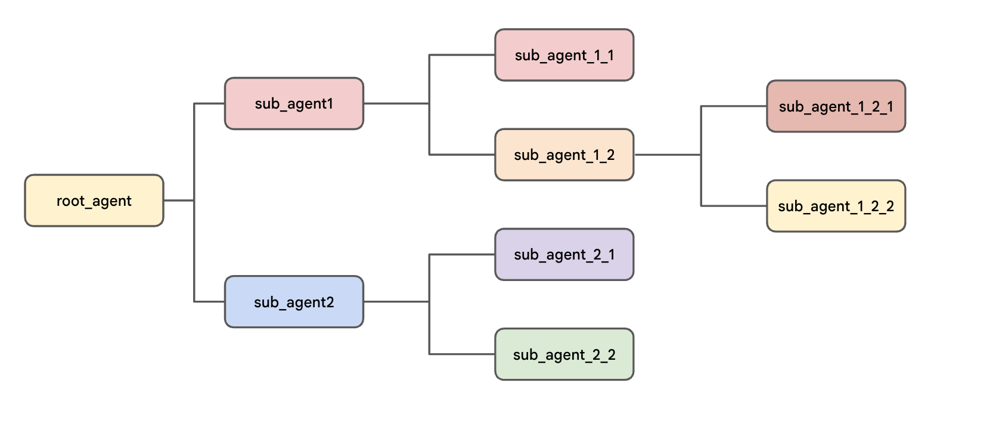

# Build multi-agent systems with ADK

### Overview

This lab covers orchestrating multi-agent systems within the Google Agent Development Kit (Google ADK).

This lab assumes that you are familiar with the basics of ADK and tool use as covered in the labs:

* Get started with Google Agent Development Kit (ADK)
* Empower ADK agents with tools

## Objective
In this lab, you will learn about multi-agent systems using the Agent Development Kit.

After this lab, you will be able to:

* Create multiple agents and relate them to one another with parent to sub-agent relationships.
* Build content across multiple turns of conversation and multiple agents by writing to a session's state dictionary
* Instruct agents to read values from the session state to use as context for their responses
* Use workflow agents to pass the conversation between agents directly

## Multi-Agent Systems

* The __Agent Development Kit__ empowers developers to get more reliable, sophisticated, multi-step behaviors from generative models. 

* Instead of writing long, complex prompts that may not deliver results reliably, you can construct a flow of multiple, simple agents that can collaborate on complex problems by dividing tasks and responsibilities.

This architectural approach offers several key advantages such as:

* __Easier to design:__ You can think in terms of agents with specific jobs and skills.
* __Specialized functions with more reliable performance:__ Specialized agents can learn from clear examples to become more reliable at their specific tasks.
* __Organization:__ Dividing the workflow into distinct agents allows for a more organized, and therefor easier to think about, approach.
* __Improvability and maintainability:__ It is easier to improve or fix a specialized component rather than make changes to a complex agent that may fix one behavior but might impact others.
* __Modularity:__ Distinct agents from one workflow can be easily copied and included in other similar workflows.

## The Hierarchical Agent Tree

  

__In Agent Development Kit, you organize your agents in a tree-like structure. This helps limit the options for transfers for each agent in the tree, making it easier to control and predict the possible routes the conversation can take through the tree. Benefits of the hierarchical structure include:__

* It draws __inspiration from real-world collaborative teams,__ making it easier to design and reason about the behavior of the multi-agent system.
* It is __intuitive for developers,__ as it mirrors common software development patterns.
* It provides __greater control over the flow__ of information and task delegation within the system, making it easier to understand possible pathways and debug the system. For example, if a system has two report-generation agents at different parts of its flow with similar descriptions, the tree structure makes it easier to ensure that the correct one is invoked.
* The structure always begins with the agent defined in the root_agent variable (although it may have a different user-facing name to identify itself). The root_agent may act as a parent to one or more sub-agents. Each sub-agent agent may have its own sub-agents.
